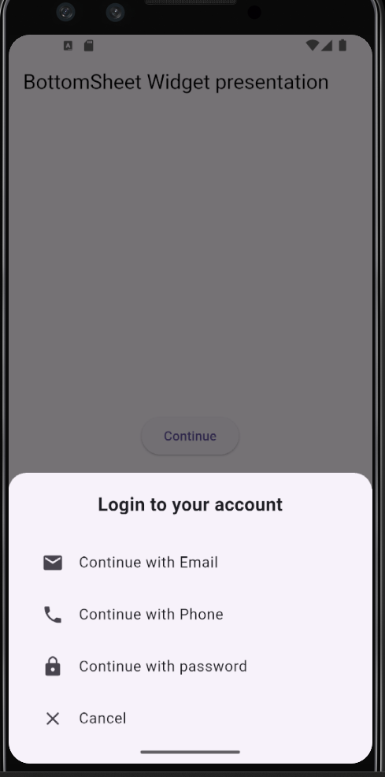

#Flutter BottomSheet Demo
 This project demostrates the use of Flutter modals BottomSheet widget to display additional actions in a real-world scenario without leaving the current screen. 

 ## Widget presented

          Modal BottomSheet widget

    
    A bottom sheet is a window that slides up from the bottom edge of the screen. It is used to reveal additional content and options to users. If required, users can show and dismiss the BottomSheet widget.
    This widget is available for the Android platform only and can be created only through code. The following Gradle Entry needs to be made in order to access the BottomSheet widget.

    Following are the key use cases of Bottom Sheet widget:
    To provide a visually richer options menu. For example: when we want to share an image through an application, a BottomSheet widget can be used to show the various applications that can be used for sharing.
    To display more data or information. For example: In a map widget, when we click on a pin, you can use a BottomSheet widget to display more information about the location.
    Can be used instead of dialog boxes. For example: while exiting an app, a BottomSheet can be used to ask for confirmation.

 ## three key properties demostarted

 1.isdismissed : it allow user to remove bottomsheet by tap out of it

 2.enabledrag :this help user to slow down and the bottomsheet.

 3.shape :used to decolate top corner of bottomsheet normally.

 ## how to Run

 1.clone the repository
 2.Run 'flutter pub get'
 3.Run 'flutter run'

 ## presentation Date

 Presented in class on: '11/02/2026'

 ## screenshot
 

# bottomsheet

A new Flutter project.

## Getting Started

This project is a starting point for a Flutter application.

A few resources to get you started if this is your first Flutter project:

- [Lab: Write your first Flutter app](https://docs.flutter.dev/get-started/codelab)
- [Cookbook: Useful Flutter samples](https://docs.flutter.dev/cookbook)

For help getting started with Flutter development, view the
[online documentation](https://docs.flutter.dev/), which offers tutorials,
samples, guidance on mobile development, and a full API reference.
